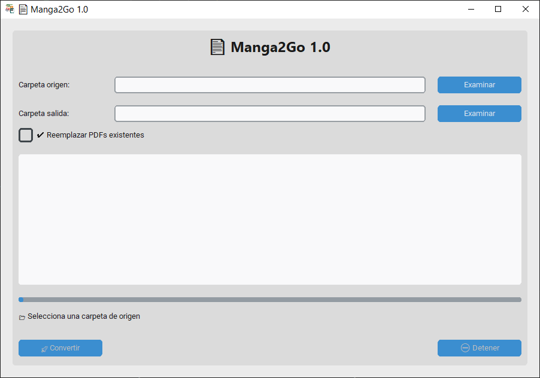
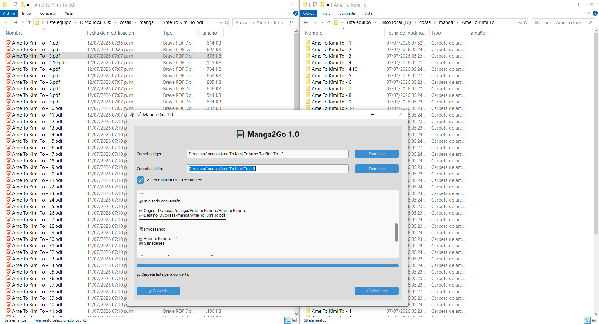
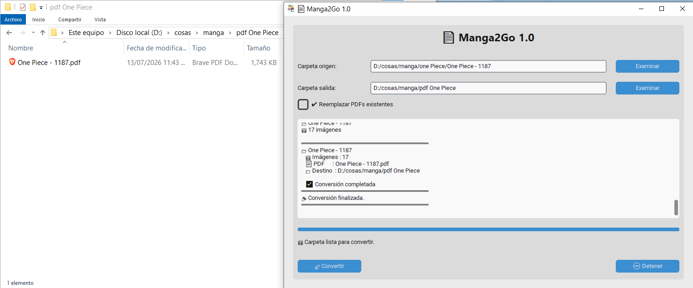

# 📚 Manga2Go

Convierte carpetas de imágenes (WebP, JPG, PNG...) en archivos PDF de forma rápida y sencilla.

---

## ✨ Características

- 📁 Convierte una carpeta completa de imágenes a PDF.
- 📚 Convierte bibliotecas completas (una carpeta por capítulo).
- 🔍 Detecta automáticamente capítulos ya convertidos.
- ♻ Permite reemplazar PDFs existentes.
- ⏹ Cancelación de la conversión.
- 📊 Barra de progreso.
- 📝 Registro detallado del proceso.
- 👓 Interfaz gráfica sencilla.
- 🚀 Aplicación portátil (no requiere instalación).

---

## 📷 Capturas

### Pantalla principal

### Comparación de capítulos

### Conversión finalizada

---

## 🚀 Descarga

Ve a la sección **Releases** y descarga la versión más reciente.

No requiere instalación.

Solo:

1. Descargar
2. Descomprimir
3. Ejecutar **Manga2Go.exe**

---

## 🛠 Tecnologías

- Python 3.14
- CustomTkinter
- Pillow
- PyInstaller

---

## 📄 Licencia

MIT License

